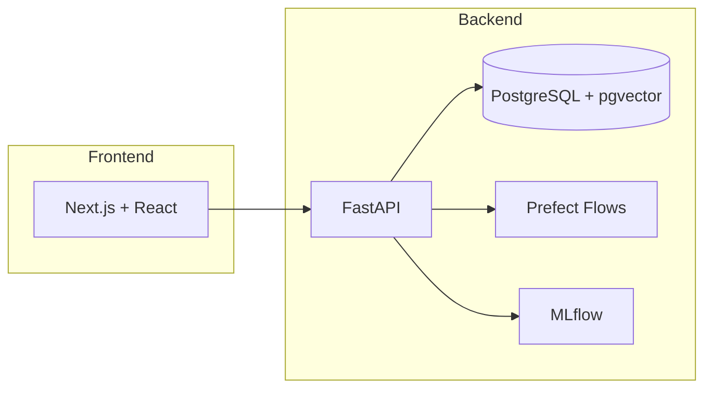

## Introduction

OpenCase is an open-source, end-to-end system for managing “Integration Cases”—from partner submissions and data ingestion through ML experimentation to MPVAL (pre-production) deployment. Inspired by Palantir Foundry, it provides:

- **Central Ontology**: A hub object (`IntegrationCase`) linking tasks, gates, risks, artifacts, deployments, and KPIs.
    
- **Audit Trail**: Immutable logs of every business action (`ActionLog`).
    
- **REST API**: Built with FastAPI and SQLModel for CRUD and action endpoints.
    
- **Interactive Dashboard**: A Next.js/React frontend for real-time monitoring and control.
    

Use OpenCase to practice core concepts—ontology modeling, pipelines, feature stores, experiment tracking, RAG agents, and deployment orchestration—without proprietary tooling.

---

## Quick Start

```bash
# Clone the repo
git clone https://github.com/your-org/opencase.git
cd opencase

# Launch services with Docker Compose
docker-compose up -d

# Run migrations
alembic upgrade head

# Seed demo data
python scripts/seed.py

# Start backend
uvicorn backend.app.main:app --reload

# Start frontend
cd frontend && npm run dev
```

Access the dashboard at [http://localhost:3000](http://localhost:3000/) and the API docs at [http://localhost:8000/docs](http://localhost:8000/docs).

---

## Architecture Overview



- **Database**: PostgreSQL with pgvector for embeddings.
    
- **ORM**: SQLModel (FastAPI) for data models and migrations.
    
- **Orchestration**: Prefect for medallion pipeline (Bronze → Silver → Gold → Platinum).
    
- **Experiment Tracking**: MLflow to log model runs and artifacts.
    
- **Dashboard**: Next.js with SWR for data fetching, TailwindCSS for styling.
    

---

## Data Model (Ontology)

### SQLModel Definitions

```python
from sqlmodel import SQLModel, Field, Relationship
from typing import List, Optional
from datetime import date, datetime

class IntegrationCase(SQLModel, table=True):
    id: Optional[int] = Field(default=None, primary_key=True)
    case_id: str = Field(index=True, unique=True)
    partner_id: int = Field(foreign_key="partner.id")
    env_target: str
    phase: str
    status: str
    planned_start: Optional[date]
    planned_end: Optional[date]
    actual_start: Optional[date]
    actual_end: Optional[date]
    sla_days: Optional[int]
    risk_level: Optional[str]
    last_updated: datetime = Field(default_factory=datetime.utcnow)

    # Relationships
    tasks: List["IntegrationTask"] = Relationship(back_populates="case")
    gates: List["ApprovalGate"] = Relationship(back_populates="case")
    risks: List["RiskIssue"] = Relationship(back_populates="case")
    artifacts: List["Artifact"] = Relationship(back_populates="case")
    deployments: List["MPVALDeployment"] = Relationship(back_populates="case")
    actions: List["ActionLog"] = Relationship(back_populates="case")
```

_Additional classes: `Partner`, `IntegrationTask`, `ApprovalGate`, `RiskIssue`, `Artifact`, `MPVALDeployment`, `ActionLog`, `Document`, `IntegrationCaseKPI`._

### Raw SQL (DDL)

```sql
CREATE TABLE integrationcase (
  id SERIAL PRIMARY KEY,
  case_id VARCHAR NOT NULL UNIQUE,
  partner_id INT NOT NULL REFERENCES partner(id),
  env_target VARCHAR NOT NULL,
  phase VARCHAR NOT NULL,
  status VARCHAR NOT NULL,
  planned_start DATE,
  planned_end DATE,
  actual_start DATE,
  actual_end DATE,
  sla_days INT,
  risk_level VARCHAR,
  last_updated TIMESTAMP NOT NULL DEFAULT now()
);
```

_Implement similar DDL for tasks, gates, risks, artifacts, deployments, logs, documents, and KPIs._

---

## Backend Reference

### Pydantic Schemas

```python
from pydantic import BaseModel, Field
from datetime import date
from typing import Optional

class CreateCasePayload(BaseModel):
    case_id: str = Field(...)
    partner_id: int
    env_target: str
    phase: str
    planned_start: Optional[date]
    planned_end: Optional[date]

class CompleteTaskPayload(BaseModel):
    completed_at: Optional[date]

class ApproveGatePayload(BaseModel):
    reason: Optional[str]

class TriggerDeployPayload(BaseModel):
    package_version: str
    notes: Optional[str]
```

### Service Layer

```python
import json
from datetime import datetime
from sqlmodel import Session
from models import IntegrationTask, ActionLog, MPVALDeployment

class TaskService:
    @staticmethod
    def complete_task(db: Session, task_id: int, payload: CompleteTaskPayload):
        task = db.get(IntegrationTask, task_id)
        task.status = "Done"
        task.updated_at = datetime.utcnow()
        db.add(task); db.commit(); db.refresh(task)
        log = ActionLog(
            case_id=task.case_id,
            entity_type="task",
            entity_id=task.id,
            action="complete",
            payload_json=json.dumps(payload.dict()),
        )
        db.add(log); db.commit()
        return task
```

### API Routes

```python
from fastapi import APIRouter, Depends, HTTPException
from sqlmodel import Session
from schemas import CompleteTaskPayload
from services import TaskService

router = APIRouter()

@router.post("/tasks/{task_id}/complete")
def complete_task(
    task_id: int,
    payload: CompleteTaskPayload,
    db: Session = Depends(get_db),
):
    task = TaskService.complete_task(db, task_id, payload)
    if not task:
        raise HTTPException(404, "Task not found")
    return task
```

_For full CRUD and action endpoints, see `routes/actions.py`._

---

## Frontend Reference

### Fetching Data with SWR

```js
import useSWR from 'swr';

const fetcher = (url) => fetch(url).then(res => res.json());
export function useCases() {
  const { data, error } = useSWR('/api/cases', fetcher);
  return { cases: data, isLoading: !error && !data, isError: error };
}
```

### Case List Page

```jsx
import { useCases } from '../lib/hooks';

export default function Cases() {
  const { cases, isLoading } = useCases();
  if (isLoading) return <p>Loading...</p>;
  return (
    <table>
      <thead>...</thead>
      <tbody>
        {cases.map(c => (
          <tr key={c.id}>
            <td>{c.case_id}</td>
            <td>{c.status}</td>
            <td><a href={`/cases/${c.id}`}>View</a></td>
          </tr>
        ))}
      </tbody>
    </table>
  );
}
```

### Case Detail Page

```jsx
import useSWR from 'swr';
import { useRouter } from 'next/router';

export default function CaseDetail() {
  const { id } = useRouter().query;
  const { data: c, error } = useSWR(id ? `/api/cases/${id}` : null, fetcher);
  if (!c) return <p>Loading...</p>;
  return (
    <div>
      <h1>Case {c.case_id}</h1>
      <p>Status: {c.status}</p>
      <button onClick={() => triggerDeploy(c.id)}>Deploy to MPVAL</button>
      {/* Render tasks, gates, risks, KPIs, agent chat */}
    </div>
  );
}
```

---

## Actions & Audit Logs

Every business operation logs an `ActionLog` entry:

|Entity|Action|Endpoint|
|---|---|---|
|`IntegrationTask`|`complete`|POST `/tasks/{id}/complete`|
|`ApprovalGate`|`approve`|POST `/gates/{id}/approve`|
|`MPVALDeployment`|`trigger_deploy`|POST `/cases/{id}/deploy/mpval`|

An `ActionLog` record contains:

- `case_id`, `entity_type`, `entity_id`, `action`
    
- `payload_json` with input details
    
- `timestamp` of the event
    

---

## Next Steps

- Flesh out remaining Pydantic request/response models
    
- Implement service-layer functions for all actions
    
- Write integration tests for API endpoints and audit logs
    
- Build Prefect flows for medallion pipeline (Bronze→Silver→Gold→Platinum)
    
- Integrate RAG agent (`/agent` endpoint) using pgvector + LangChain + OpenAI
    
- Enhance UI: graphs for KPI trends, risk heatmaps, gate progress bars
    
- Migrate locals prototype into enterprise Foundry (datasets, workflows, UDFs)
    

---

_For detailed migration steps and enterprise considerations, see the "Foundry Migration Roadmap" section in the report._


Ontology 

Which model is being developed?
What datasets/feature sets feed it?
Which expermients and versions exist, what were their KPIs
What gates/approvals has it passed failed
Which tools/platforms were used
Where is the current deployment and status

ModelWork
 ├─ ModelVersion(s)
 │   ├─ Experiment(s)
 │   │   ├─ Metrics
 │   │   └─ Artifacts (weights, notebooks, reports)
 │   ├─ ValidationReport(s)
 │   └─ ApprovalGate(s)
 ├─ Dataset(s) / FeatureSet(s)
 ├─ RiskAssessment(s)
 ├─ DeploymentTarget(s)
 ├─ ToolUsage(s)
 └─ Contacts / Roles


## 3. Suggested Classes & Key Properties

| Class / Entity           | Key Properties (examples)                                    | Relations                                                           |
| ------------------------ | ------------------------------------------------------------ | ------------------------------------------------------------------- |
| **ModelWork**            | id, name, businessUseCase, status, creationDate              | hasVersion → ModelVersion; usesDataset → Dataset; ownedBy → Role    |
| **ModelVersion**         | versionTag, createdOn, description, codeRepoRef              | hasExperiment → Experiment; validatedBy → ValidationReport          |
| **Experiment**           | experimentId, hyperparams, start/end time, seed              | producedMetrics → MetricSet; producedArtifact → Artifact            |
| **MetricSet**            | metricName/values (AUC, F1, RMSE…), thresholdCompliance      | belongsTo → Experiment or ValidationReport                          |
| **ValidationReport**     | reportId, validator, date, pass/fail, issues                 | summarizesMetrics → MetricSet; requiredForGate → ApprovalGate       |
| **ApprovalGate**         | gateName (QG1, QG2…), decision, decisionDate, approver       | referencesReport → ValidationReport; advancesVersion → ModelVersion |
| **Dataset / FeatureSet** | datasetId, sourceSystem, schemaRef, PII_flag, refreshFreq    | supportsVersion → ModelVersion; governedBy → Policy                 |
| **Artifact**             | type (weights, notebook, doc), uri/storagePath, checksum     | generatedBy → Experiment; usedIn → DeploymentTarget                 |
| **DeploymentTarget**     | env (MPVAL, PROD), endpointURL, deploymentDate, rollbackPlan | deploysVersion → ModelVersion                                       |
| **RiskAssessment**       | assessmentId, riskType, severity, mitigationPlan             | appliesTo → ModelWork or ModelVersion                               |
| **ToolUsage**            | toolName, version, accessPath                                | usedIn → Experiment or ValidationReport                             |
| **Policy / Control**     | policyId, description, type (security, export, data)         | governs → Dataset / ModelWork / DeploymentTarget                    |
| **Role / Contact**       | roleName, person, email                                      | responsibleFor → ModelWork/Experiment; approves → ApprovalGate      |


## How It Connects Back to Your Existing Ontology

- `ModelWork` would relate to **Onboarding** via: “Partner X is onboarded → grants permission to create ModelWork objects.”
    
- `Offboarding` will reference `ModelWork` for data disposition, artifact archival, and access revocation.
    
- RACI/roles from earlier sections can be reused: `Role` objects already exist; link them to new steps (experiments, approval gates, deployments).
## . Visualization Hooks

- **Model Lineage Graph:** ModelWork → Versions → Experiments → Datasets
    
- **Gate Timeline:** Version vs. Gates passed (QG1, QG2 …)
    
- **Metrics Dashboard:** Query MetricSets for KPIs across versions
    
- **Risk Map:** Severity vs. mitigation status
    

---

## 7. Next Steps

1. Confirm which **gates** and **reports** are mandatory in your pipeline (e.g., MOCA/QG).
    
2. Decide whether you want **Experiment-level granularity** (useful if you auto-extract from MLflow).
    
3. Pick the representation tech (RDF/OWL vs JSON/YAML/Neo4j).
    
4. Prototype one real model’s data to pressure-test the schema.
    
5. Hook the ontology into your document generator/dashboard.